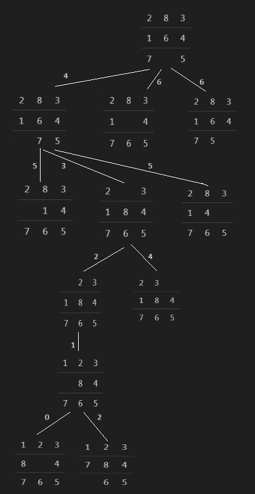

# 8-Puzzle Hill-Climbing Algorithm

## Problem Description

The 8-puzzle is a sliding puzzle that consists of a 3x3 grid with 8 numbered tiles and one empty space. The goal is to reach a specific arrangement of the tiles from a given initial state using various moves.

**Initial State:**

<table>
  <tr>
    <td>2</td>
    <td>8</td>
    <td>3</td>
  </tr>
  <tr>
    <td>1</td>
    <td>6</td>
    <td>4</td>
  </tr>
  <tr>
    <td>7</td>
    <td> </td>
    <td>5</td>
  </tr>
</table>

**Goal State:**

<table>
  <tr>
    <td>1</td>
    <td>2</td>
    <td>3</td>
  </tr>
  <tr>
    <td>8</td>
    <td> </td>
    <td>4</td>
  </tr>
  <tr>
    <td>7</td>
    <td>6</td>
    <td>5</td>
  </tr>
</table>

## Solution with Manhattan Distance Heuristic

The Manhattan distance heuristic is used to evaluate the desirability of a state. It calculates the sum of the Manhattan distances of each tile from its goal position.

**Step 1: Initial State**

<table>
  <tr>
    <td>2</td>
    <td>8</td>
    <td>3</td>
  </tr>
  <tr>
    <td>1</td>
    <td>6</td>
    <td>4</td>
  </tr>
  <tr>
    <td>7</td>
    <td> </td>
    <td>5</td>
  </tr>
</table>

By definition, the Manhattan distance heuristic is the sum of
the Manhattan distances of tiles from their goal positions.

The tiles 2, 8, 1 and 6 are misplaced and their
distances from the goal positions are respectively 1, 2, 1 and 1.
> Therefore, h(Initial state) = 5.

The middle cell in the target state has no value so we will not compare it.

**Step 2: Generate Successors**
<table>
  <tr>
    <td>2</td>
    <td>8</td>
    <td>3</td>
  </tr>
  <tr>
    <td>1</td>
    <td> </td>
    <td>4</td>
  </tr>
  <tr>
    <td>7</td>
    <td>6</td>
    <td>5</td>
  </tr>
</table>

> h(2a) = 4

<table>
  <tr>
    <td>2</td>
    <td>8</td>
    <td>3</td>
  </tr>
  <tr>
    <td>1</td>
    <td>6</td>
    <td>4</td>
  </tr>
  <tr>
    <td> </td>
    <td>7</td>
    <td>5</td>
  </tr>
</table>

> h(2b) = 6

<table>
  <tr>
    <td>2</td>
    <td>8</td>
    <td>3</td>
  </tr>
  <tr>
    <td>1</td>
    <td>6</td>
    <td>4</td>
  </tr>
  <tr>
    <td>7</td>
    <td>5</td>
    <td> </td>
  </tr>
</table>

> h(2c) = 6

Then, choose the state with the **minimum heuristic** h = 4.
<table>
  <tr>
    <td>2</td>
    <td>8</td>
    <td>3</td>
  </tr>
  <tr>
    <td>1</td>
    <td> </td>
    <td>4</td>
  </tr>
  <tr>
    <td>7</td>
    <td>6</td>
    <td>5</td>
  </tr>
</table>

**Step 3: Continue Search**

<table>
  <tr>
    <td>2</td>
    <td>8</td>
    <td>3</td>
  </tr>
  <tr>
    <td> </td>
    <td>1</td>
    <td>4</td>
  </tr>
  <tr>
    <td>7</td>
    <td>6</td>
    <td>5</td>
  </tr>
</table>

> h(3a) = 5

<table>
  <tr>
    <td>2</td>
    <td> </td>
    <td>3</td>
  </tr>
  <tr>
    <td>1</td>
    <td>8</td>
    <td>4</td>
  </tr>
  <tr>
    <td>7</td>
    <td>6</td>
    <td>5</td>
  </tr>
</table>

> h(3b) = 3

<table>
  <tr>
    <td>2</td>
    <td>8</td>
    <td>3</td>
  </tr>
  <tr>
    <td>1</td>
    <td>4</td>
    <td> </td>
  </tr>
  <tr>
    <td>7</td>
    <td>6</td>
    <td>5</td>
  </tr>
</table>

> h(3c) = 5

Choose the state with the  heuristic h = 3.
<table>
  <tr>
    <td>2</td>
    <td> </td>
    <td>3</td>
  </tr>
  <tr>
    <td>1</td>
    <td>8</td>
    <td>4</td>
  </tr>
  <tr>
    <td>7</td>
    <td>6</td>
    <td>5</td>
  </tr>
</table>

**Continuous states:**

<table>
  <tr>
    <td> </td>
    <td>2</td>
    <td>3</td>
  </tr>
  <tr>
    <td>1</td>
    <td>8</td>
    <td>4</td>
  </tr>
  <tr>
    <td>7</td>
    <td>6</td>
    <td>5</td>
  </tr>
</table>

> h(4) = 2


<table>
  <tr>
    <td>1</td>
    <td>2</td>
    <td>3</td>
  </tr>
  <tr>
    <td> </td>
    <td>8</td>
    <td>4</td>
  </tr>
  <tr>
    <td>7</td>
    <td>6</td>
    <td>5</td>
  </tr>
</table>

> h(5) = 1

<table>
  <tr>
    <td>1</td>
    <td>2</td>
    <td>3</td>
  </tr>
  <tr>
    <td>8</td>
    <td> </td>
    <td>4</td>
  </tr>
  <tr>
    <td>7</td>
    <td>6</td>
    <td>5</td>
  </tr>
</table>

> h(6) = 0 

**So, the goal found!**

## Solution with Number of Misplaced Tiles

This heuristic evaluates the desirability of a state based on the number of tiles that differ from the goal state.

**Step 1: Initial State**

<table>
  <tr>
    <td>2</td>
    <td>8</td>
    <td>3</td>
  </tr>
  <tr>
    <td>1</td>
    <td>6</td>
    <td>4</td>
  </tr>
  <tr>
    <td>7</td>
    <td> </td>
    <td>5</td>
  </tr>
</table>

The tiles 2, 8, 1 and 6 are misplaced and their
distances from the goal positions are respectively 1, 2, 1 and 1.
> Therefore, h(Initial state) = 4.

**Step 2: Generate Successors**
<table>
  <tr>
    <td>2</td>
    <td>8</td>
    <td>3</td>
  </tr>
  <tr>
    <td>1</td>
    <td>6</td>
    <td>4</td>
  </tr>
  <tr>
    <td> </td>
    <td>7</td>
    <td>5</td>
  </tr>
</table>

> h(2a) = 5

<table>
  <tr>
    <td>2</td>
    <td>8</td>
    <td>3</td>
  </tr>
  <tr>
    <td>1</td>
    <td> </td>
    <td>4</td>
  </tr>
  <tr>
    <td>7</td>
    <td>6</td>
    <td>5</td>
  </tr>
</table>

> h(2b) = 3

<table>
  <tr>
    <td>2</td>
    <td>8</td>
    <td>3</td>
  </tr>
  <tr>
    <td>1</td>
    <td>6</td>
    <td>4</td>
  </tr>
  <tr>
    <td>7</td>
    <td>5</td>
    <td> </td>
  </tr>
</table>

> h(2c) = 5

Then, choose the state with the **minimum heuristic** h = 3.
<table>
  <tr>
    <td>2</td>
    <td>8</td>
    <td>3</td>
  </tr>
  <tr>
    <td>1</td>
    <td> </td>
    <td>4</td>
  </tr>
  <tr>
    <td>7</td>
    <td>6</td>
    <td>5</td>
  </tr>
</table>

**Step 3: Continue Search**

<table>
  <tr>
    <td>2</td>
    <td>8</td>
    <td>3</td>
  </tr>
  <tr>
    <td> </td>
    <td>1</td>
    <td>4</td>
  </tr>
  <tr>
    <td>7</td>
    <td>6</td>
    <td>5</td>
  </tr>
</table>

> h(3a) = 3

<table>
  <tr>
    <td>2</td>
    <td> </td>
    <td>3</td>
  </tr>
  <tr>
    <td>1</td>
    <td>8</td>
    <td>4</td>
  </tr>
  <tr>
    <td>7</td>
    <td>6</td>
    <td>5</td>
  </tr>
</table>

> h(3b) = 3

<table>
  <tr>
    <td>2</td>
    <td>8</td>
    <td>3</td>
  </tr>
  <tr>
    <td>1</td>
    <td>4</td>
    <td> </td>
  </tr>
  <tr>
    <td>7</td>
    <td>6</td>
    <td>5</td>
  </tr>
</table>

> h(3c) = 4

Choose the state with the  heuristic h = 3.
<table>
  <tr>
    <td>2</td>
    <td> </td>
    <td>3</td>
  </tr>
  <tr>
    <td>1</td>
    <td>8</td>
    <td>4</td>
  </tr>
  <tr>
    <td>7</td>
    <td>6</td>
    <td>5</td>
  </tr>
</table>

**Continuous states:**

<table>
  <tr>
    <td> </td>
    <td>2</td>
    <td>3</td>
  </tr>
  <tr>
    <td>1</td>
    <td>8</td>
    <td>4</td>
  </tr>
  <tr>
    <td>7</td>
    <td>6</td>
    <td>5</td>
  </tr>
</table>

> h(4) = 2


<table>
  <tr>
    <td>1</td>
    <td>2</td>
    <td>3</td>
  </tr>
  <tr>
    <td> </td>
    <td>8</td>
    <td>4</td>
  </tr>
  <tr>
    <td>7</td>
    <td>6</td>
    <td>5</td>
  </tr>
</table>

> h(5) = 1

<table>
  <tr>
    <td>1</td>
    <td>2</td>
    <td>3</td>
  </tr>
  <tr>
    <td>8</td>
    <td> </td>
    <td>4</td>
  </tr>
  <tr>
    <td>7</td>
    <td>6</td>
    <td>5</td>
  </tr>
</table>

> h(6) = 0 

**So, the goal found!**

## The search tree (graph)



## Pseudocode

```python
function eightPuzzle(start, goal) returns a solution state
    inputs: start (current node), goal (destination state)

    local variables:
        current // a node
        next    // a node

    current ← start

    loop do until
        next ← the successor with the minimum h value of current

        if Value[next] > Value[current] return current

        current ← next
    end loop
```

## Python implementation

**PuzzleGUI Class:**

- **__init__*: Initializes the PuzzleGUI class. It sets up the initial sta*te, goal state, and creates the GUI.
- **create_board**: Creates the 3x3 grid of tiles in the GUI. Each tile is a Label widget, and the grid is created using the grid manager.
- **update_board**: Updates the GUI to reflect the current state of the puzzle.
- **solve_puzzle**: Initiates the hill climbing algorithm and updates the GUI with the solution.

**manhattan_distance Function:**

This function is to calculate the Manhattan distance heuristic between the current state and the goal state. 

**find_position Function:**

This function finds the position (row, column) of a specific value in the puzzle state.

**generate_successors Function:**

This function generates successor states by moving the empty tile in different directions (up, down, left, right).

**hill_climbing Function:**

This function performs the hill climbing algorithm to find a solution state.
It iteratively explores neighboring states and chooses the one with the minimum Manhattan distance heuristic.

> The algorithm terminates when it reaches a state where no neighbor has a lower heuristic value.

**main Block:**

- Initializes the initial and goal states for the 8-puzzle.
- Creates the Tkinter root window and PuzzleGUI instance.
- Initiates the Tkinter event loop.