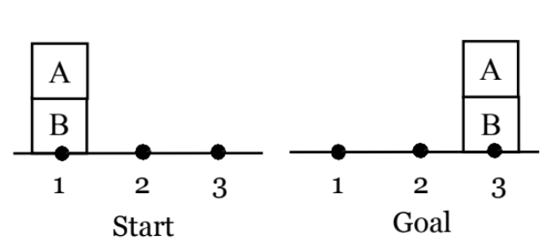

# Blocks World

## Problem Description

Consider a Blocks World that takes into account the block and robot arm positions. Assume that there are 3 positions on the table where blocks can be placed. Initially, the robot arm is at position 1.

In each step, the robot can perform one of the following actions:

- Unstacking a block X from another block Y; the robot arm must be currently at the same position as the two blocks. Name this operation Un-stack.
- Stacking a block X on another block Y; the robot arm must currently hold block X and be at the same position as block Y. Name this operation Stack.
- Picking up a block from a position on the table; the robot arm must be currently at that position. Name this operation Pickup.
- Putting down a block to a position on the table; the robot arm must be currently at that position. Name this operation Putdown.
- Moving the empty robot arm from its current position to another position. Name this operation Arm-move.
- Moving the robot arm holding a block from its current position to another position. Name this operation Block-move.

### Start Conditions:
- `CLEAR(A)`
- `ON(A, B)`
- `ONTABLE(B)`
- `POS(A, 1)`
- `POS(B, 1)`
- `POS(ARM, 1)`
- `ARMEMPTY`
- `CLEARTABLE(2)`
- `CLEARTABLE(3)`

### Goal Conditions:
- `CLEAR(A)`
- `ON(A, B)`
- `ONTABLE(B)`
- `POS(A, 3)`
- `POS(B, 3)`
- `CLEARTABLE(1)`
- `CLEARTABLE(2)`

## Specifications of Actions:

#### 1. UN-STACK(X, Y):
   - **Precondition:** `ON(X, Y) AND CLEAR(X) AND ARMEMPTY AND POS(X, P) AND POS(ARM, P)`
   - **Add:** `HOLDING(X)` AND `CLEAR(Y)`
   - **Delete:** `ARMEMPTY` AND `ON(X, Y)`

#### 2. STACK(X, Y):
   - **Precondition:** `HOLDING(X) AND CLEAR(Y) AND POS(Y, P) AND POS(ARM, P)`
   - **Add:** `ON(X, Y)` AND `ARMEMPTY`
   - **Delete:** `HOLDING(X)` AND `CLEAR(Y)`

#### 3. PICKUP(X):
   - **Precondition:** `ONTABLE(X) AND CLEAR(X) AND ARMEMPTY AND POS(X, P) AND POS(ARM, P)`
   - **Add:** `HOLDING(X)` AND `CLEARTABLE(P)`
   - **Delete:** `ARMEMPTY` AND `ONTABLE(X)`

#### 4. PUTDOWN(X):
   - **Precondition:** `HOLDING(X) AND POS(ARM, P) AND CLEARTABLE(P)`
   - **Add:** `ONTABLE(X)` AND `ARMEMPTY`
   - **Delete:** `HOLDING(X)` AND `CLEARTABLE(P)`

#### 5. ARM-MOVE(P):
   - **Precondition:** `ARMEMPTY AND POS(ARM, P1) AND P1 ≠ P`
   - **Add:** `POS(ARM, P)`
   - **Delete:** `POS(ARM, P1)`

#### 6. BLOCK-MOVE(X, P):
   - **Precondition:** `HOLDING(X) AND POS(X, P1) AND POS(ARM, P1) AND P1 ≠ P`
   - **Add:** `POS(ARM, P)` AND `POS(X, P)`
   - **Delete:** `POS(ARM, P1)` AND `POS(X, P1)`

## Goal Stack Planning

1. UN-STACK(A, B)
2. BLOCK-MOVE(A,2)
3. PUTDOWN(A)
4. ARM-MOVE(1)
5. PICKUP(B)
6. BLOCK-MOVE(B, 3)
7. PUTDOWN(B)
8. ARM-MOVE(2)
9. PICKUP(A)
10. BLOCK-MOVE(A, 3)
11. PUTDOWN(A)