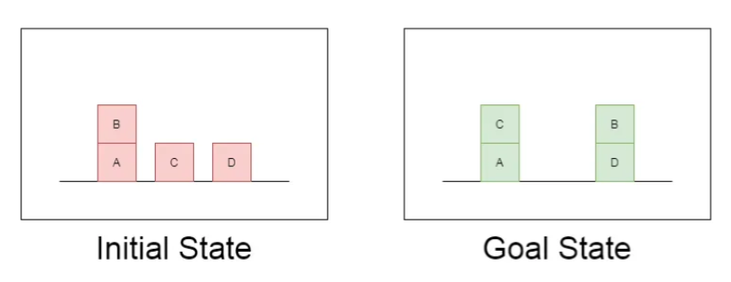
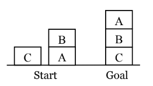

# Goal Stack Planning for Blocks World Problem

## Blocks World Problem

The Blocks World Problem involves a table on which various blocks are placed, and a robot arm that can perform operations to manipulate these blocks. The goal is to transform the initial configuration of blocks on the table into a desired final configuration using a series of predefined operations.

## Goal Stack Planning

Goal Stack Planning is one of the earliest methods in artificial intelligence in which we work backwards from the goal state to the initial state. This outlines the problem, initial and goal states, operations, and a step-by-step plan to achieve the desired final state in the Blocks World.

## Operations and Preconditions:
1. **STACK(X, Y):** Stacking Block X on Block Y
2. **UNSTACK(X, Y):** Picking up Block X which is on top of Block Y
3. **PICKUP(X):** Picking up Block X which is on top of the table
4. **PUTDOWN(X):** Put Block X on the table

All the four operations have certain preconditions which need to be satisfied to perform the same. These preconditions are represented in the form of predicates.

The effect of these operations is represented using two lists ADD and DELETE. DELETE List contains the predicates which will cease to be true once the operation is performed. ADD List on the other hand contains the predicates which will become true once the operation is performed.

### STACK(x, y):

- **Preconditions:** CLEAR(y) ∧ HOLDING(x)
- **DELETE List:** CLEAR(y) ∧ HOLDING(x)
- **ADD List:** ARMEMPTY ∧ ON(x, y)

### UNSTACK(x, y):

- **Preconditions:** ON(x, y) ∧ CLEAR(x) ∧ ARMEMPTY
- **DELETE List:** ON(x, y) ∧ ARMEMPTY
- **ADD List:** HOLDING(x) ∧ CLEAR(y)

### PICKUP(x):

- **Preconditions:** CLEAR(x) ∧ ONTABLE(x) ∧ ARMEMPTY
- **DELETE List:** ONTABLE(x) ∧ ARMEMPTY
- **ADD List:** HOLDING(x)

### PUTDOWN(x):

- **Preconditions:** HOLDING(x)
- **DELETE List:** HOLDING(x)
- **ADD List:** ONTABLE(x) ∧ ARMEMPTY

## The First Blocks World Problem

### Initial State:  
ON(B,A) ∧  
ONTABLE(A) ∧ ONTABLE(C) ∧ ONTABLE(D) ∧  
CLEAR(B) ∧ CLEAR(C) ∧ CLEAR(D) ∧   
ARMEMPTY

### Goal State:  
ON(C,A) ∧ ON(B,D) ∧  
ONTABLE(A) ∧ ONTABLE(D) ∧  
CLEAR(B) ∧ CLEAR(C) ∧  
ARMEMPTY

### Solution

1. **UNSTACK(B, A)**
    - **Stack**: Pre-stack(B, D), STACK(B, D), ON(C, A), Goal
    - **Database**: ONTABLE(A) ∧ ONTABLE(C) ∧ ONTABLE(D) ∧ CLEAR(B) ∧ CLEAR(C) ∧ CLEAR(D) ∧ HOLDING(B)
2. **STACK(B, D)**
    - **Stack**: ON(C, A), Goal
    - **Database**: ONTABLE(A) ∧ ONTABLE(C) ∧ ONTABLE(D) ∧ CLEAR(B) ∧ CLEAR(C) ∧ ON(B, D)
3. **PICKUP(C)**
    - **Stack**: Pre-stack(C, A), STACK(C, A), Goal
    - **Database**: ONTABLE(A) ∧ ONTABLE(D) ∧ CLEAR(B) ∧ CLEAR(C) ∧ CLEAR(A) ∧ HOLDING(C) ∧ ON(B, D)
4. **STACK(C, A)**
    - **Stack**: Goal
    - **Database**: ONTABLE(A) ∧ ONTABLE(D) ∧ CLEAR(B) ∧ CLEAR(C) ∧ ON(C, A) ∧ ON(B, D)

## The Second Blocks World Problem

### Initial State:  
ON(C, A) ∧  
ONTABLE(A) ∧ ONTABLE(C) ∧  
CLEAR(B) ∧ CLEAR(C) ∧   
ARMEMPTY

### Goal State:  
ON(A, B) ∧ ON(B, C) ∧  
ONTABLE(C) ∧ CLEAR(A) ∧  
ARMEMPTY

### Solution

1. UNSTACK(B,A)
2. STACK(B,C)
3. PICKUP(A)
4. STACK(A,B)

## Implementation

### Base Classes

`PREDICATE` Class:

- Represents predicates in the blocks world.
- Methods:
  - `__str__`: String representation of the predicate.
  - `__repr__`: String representation for debugging.
  - `__eq__`: Equality comparison for predicates.
  - `__hash__`: Hash value for predicates.
  - `get_action`: Returns an action based on the current world state.

`Operation` Class:

- Represents operations (actions) in the blocks world.
- Methods:
  - `__str__`: String representation of the operation.
  - `__repr__`: String representation for debugging.
  - `__eq__`: Equality comparison for operations.
  - `precondition`: List of predicates required for the operation.
  - `delete`: List of predicates to remove after the operation.
  - `add`: List of predicates to add after the operation.

## Predicate Classes

`ON`, `ONTABLE`, `CLEAR`, `HOLDING`, `ARMEMPTY`:

- Specific predicate classes representing conditions in the blocks world.
- Inherit from `PREDICATE` class.
- Provide specific implementations for initialization, string representation, equality comparison, and action retrieval based on the world state.

## Operation Classes

`StackOp`, `UnstackOp`, `PickupOp`, `PutdownOp`:

- Specific operation classes representing actions in the blocks world.
- Inherit from `Operation` class.
- Provide implementations for initialization, string representation, equality comparison, preconditions, deletions, and additions.

`NoOp` Class:

- Represents a "do nothing" operation.
- Used when no applicable action is found for a goal.

## Utility Functions

`isPredicate` and `isOperation` Functions:

- Helper functions to check if an object is an instance of a predicate or an operation, respectively.

`arm_status` Function:

- Returns the status of the arm (holding a block or empty) based on the given world state.

## `GoalStackPlanner` Class

- Represents the goal stack planner.
- Takes initial and goal states as input.
- Method `get_steps`: Finds a sequence of steps to achieve the goal from the initial state using a goal stack planning approach.

## Main Block

- Creates initial and goal states for a blocks world scenario.
- Initializes a `GoalStackPlanner`.
- Calls `get_steps` to get the sequence of steps to achieve the goal and prints the solution.
