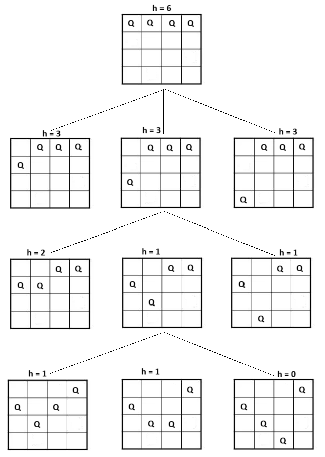

# N-Queens Problem Solution Using Hill Climbing

Consider the n-queens problem: the problem is to place n chess queens on an n×n chessboard such that no two queens attack each other. That is no two queens share the same row, column,
or diagonal.

Hill Climbing can be applied to solve the n-queens problem as follows. In each step, only one queen can be moved and the queens that have been moved in previous steps will not be moved again. The heuristic function is defined to be the number of pairs of queens that are attacking each other. The goal state thus has value 0.

Illustrate how the method works for the 4-queens problem via search tree expansion. Assume the initial state as below, whose heuristic function value is 6.

**Initial State:**

<table>
  <tr>
    <td> Q </td>
    <td> Q </td>
    <td> Q </td>
    <td> Q </td>
  </tr>
  <tr>
    <td> </td>
    <td> </td>
    <td> </td>
    <td> </td>
  </tr>
  <tr>
    <td> </td>
    <td> </td>
    <td> </td>
    <td> </td>
  </tr>
  <tr>
    <td> </td>
    <td> </td>
    <td> </td>
    <td> </td>
  </tr>
</table>

## Heuristic function

The heuristic function in this case is defined to be the number of pairs of queens that are attacking each other.

The heuristic value is initially 6.

## Solution

### Step 1: Move the first queen

<table>
  <tr>
    <td>  </td>
    <td> Q </td>
    <td> Q </td>
    <td> Q </td>
  </tr>
  <tr>
    <td> Q </td>
    <td> </td>
    <td> </td>
    <td> </td>
  </tr>
  <tr>
    <td> </td>
    <td> </td>
    <td> </td>
    <td> </td>
  </tr>
  <tr>
    <td> </td>
    <td> </td>
    <td> </td>
    <td> </td>
  </tr>
</table>

> h(1a) = 3

<table>
  <tr>
    <td>  </td>
    <td> Q </td>
    <td> Q </td>
    <td> Q </td>
  </tr>
  <tr>
    <td>  </td>
    <td> </td>
    <td> </td>
    <td> </td>
  </tr>
  <tr>
    <td> Q </td>
    <td> </td>
    <td> </td>
    <td> </td>
  </tr>
  <tr>
    <td> </td>
    <td> </td>
    <td> </td>
    <td> </td>
  </tr>
</table>

> h(1b) = 3

<table>
  <tr>
    <td>  </td>
    <td> Q </td>
    <td> Q </td>
    <td> Q </td>
  </tr>
  <tr>
    <td>  </td>
    <td>  </td>
    <td>  </td>
    <td> </td>
  </tr>
  <tr>
    <td> </td>
    <td> </td>
    <td> </td>
    <td> </td>
  </tr>
  <tr>
    <td> Q </td>
    <td> </td>
    <td> </td>
    <td> </td>
  </tr>
</table>

> h(1c) = 3

For the same heuristic function value 3, choose the first generated one.

### Step 2: Move the second queen

<table>
  <tr>
    <td>  </td>
    <td>  </td>
    <td> Q </td>
    <td> Q </td>
  </tr>
  <tr>
    <td> Q </td>
    <td> Q</td>
    <td> </td>
    <td> </td>
  </tr>
  <tr>
    <td> </td>
    <td> </td>
    <td> </td>
    <td> </td>
  </tr>
  <tr>
    <td> </td>
    <td> </td>
    <td> </td>
    <td> </td>
  </tr>
</table>

> h(2a) = 2

<table>
  <tr>
    <td>  </td>
    <td>  </td>
    <td> Q </td>
    <td> Q </td>
  </tr>
  <tr>
    <td> Q </td>
    <td> </td>
    <td> </td>
    <td> </td>
  </tr>
  <tr>
    <td>  </td>
    <td> Q</td>
    <td> </td>
    <td> </td>
  </tr>
  <tr>
    <td> </td>
    <td> </td>
    <td> </td>
    <td> </td>
  </tr>
</table>

> h(2b) = 1

<table>
  <tr>
    <td>  </td>
    <td>  </td>
    <td> Q </td>
    <td> Q </td>
  </tr>
  <tr>
    <td>  Q </td>
    <td>  </td>
    <td></td>
    <td> </td>
  </tr>
  <tr>
    <td> </td>
    <td> </td>
    <td> </td>
    <td> </td>
  </tr>
  <tr>
    <td> </td>
    <td>Q </td>
    <td> </td>
    <td> </td>
  </tr>
</table>

> h(2c) = 1

For the same heuristic function value 1, choose the first generated one.

### Step 3: Move the third queen

<table>
  <tr>
    <td>  </td>
    <td>  </td>
    <td>  </td>
    <td> Q </td>
  </tr>
  <tr>
    <td> Q </td>
    <td> </td>
    <td>Q </td>
    <td> </td>
  </tr>
  <tr>
    <td>  </td>
    <td> Q</td>
    <td> </td>
    <td> </td>
  </tr>
  <tr>
    <td> </td>
    <td> </td>
    <td> </td>
    <td> </td>
  </tr>
</table>

> h(3a) = 1

<table>
  <tr>
    <td>  </td>
    <td>  </td>
    <td>  </td>
    <td> Q </td>
  </tr>
  <tr>
    <td> Q </td>
    <td> </td>
    <td> </td>
    <td> </td>
  </tr>
  <tr>
    <td>  </td>
    <td> Q</td>
    <td> Q</td>
    <td> </td>
  </tr>
  <tr>
    <td> </td>
    <td> </td>
    <td> </td>
    <td> </td>
  </tr>
</table>

> h(3b) = 1

<table>
  <tr>
    <td>  </td>
    <td>  </td>
    <td>  </td>
    <td> Q </td>
  </tr>
  <tr>
    <td> Q </td>
    <td> </td>
    <td> </td>
    <td> </td>
  </tr>
  <tr>
    <td>  </td>
    <td> Q</td>
    <td> </td>
    <td> </td>
  </tr>
  <tr>
    <td> </td>
    <td> </td>
    <td> Q</td>
    <td> </td>
  </tr>
</table>

> h(3c) = 0

Therefore, the goal is the one with heuristic function value 0.

<table>
  <tr>
    <td>  </td>
    <td>  </td>
    <td>  </td>
    <td> Q </td>
  </tr>
  <tr>
    <td> Q </td>
    <td> </td>
    <td> </td>
    <td> </td>
  </tr>
  <tr>
    <td>  </td>
    <td> Q</td>
    <td> </td>
    <td> </td>
  </tr>
  <tr>
    <td> </td>
    <td> </td>
    <td> Q</td>
    <td> </td>
  </tr>
</table>

## Search Tree

